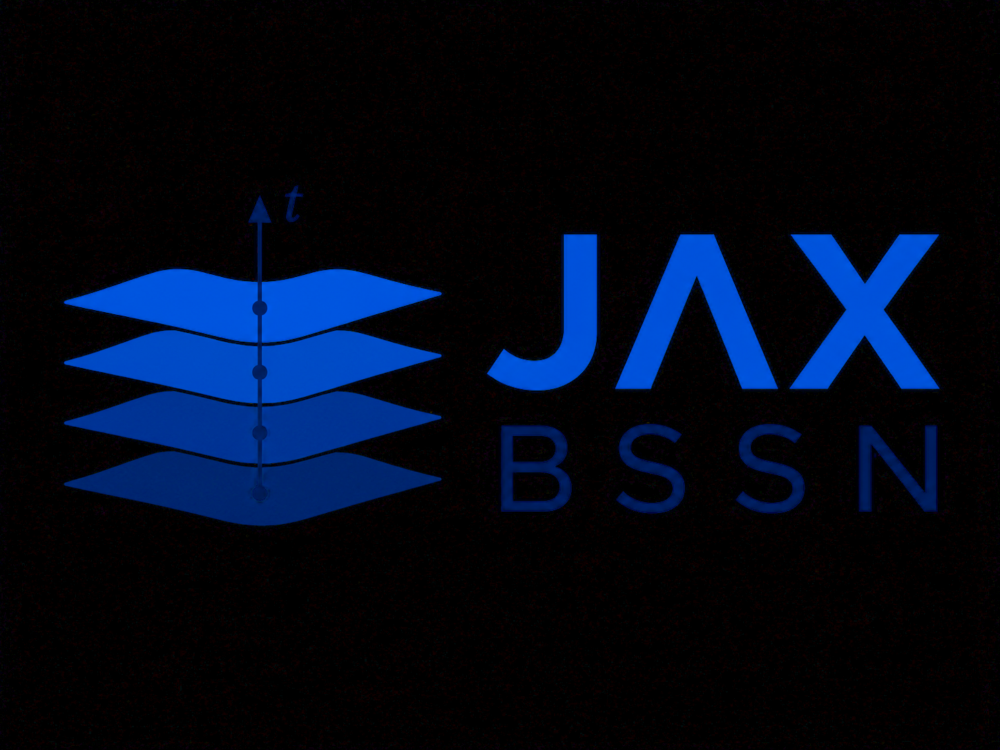

# JAX BSSN

<p align="center">
  
</p>

JAX-BSSN is an autodifferentiable implementation of the BSSN evolution system
for numerical relativity. JAX-BSSN features Kreiss–Oliger dissipation, momentum
constraint damping, and fixed mesh refinement.

## Installation

From the repository root:

```bash
python -m venv .venv
source .venv/bin/activate
python -m pip install --upgrade pip
python -m pip install -e ".[demos,test]"
```

Install a JAX build appropriate for the intended CPU or accelerator when the
default dependency does not match the target hardware.

## Supported demos

The supported physical examples are:

1. Gauge wave
2. Linear wave
3. Single puncture
4. Spherical Cartoon puncture
5. Axisymmetric Cartoon puncture
6. Axisymmetric boosted Bowen--York puncture

Each demo owns its initial data and run configuration. There is no generic
simulation CLI or installed initial-data dispatcher.

Run the periodic analytic gauge wave:

```bash
python demos/gauge_wave/gauge_wave.py
```

Run the linear wave through a nested fixed-refinement hierarchy and write composite
openPMD output:

```bash
python demos/linear_wave/linear_wave.py
```

Run the single Schwarzschild puncture from its demo directory so snapshots and
the optional movie helper share one output path:

```bash
cd demos/single_puncture
python single_puncture.py
python make_movies.py  # optional; requires ffmpeg
```

Run the compact spherical Cartoon puncture and write its complete reflected
axis to openPMD:

```bash
python demos/cartoon_puncture/cartoon_puncture.py
```

Run the z-axis axisymmetric Cartoon puncture and write a signed x-z plane:

```bash
python demos/axisymmetric_cartoon_puncture/axisymmetric_cartoon_puncture.py
```

Run a black hole with Bowen--York momentum along the positive z axis, then
render grouped BSSN movies with a tracked puncture position:

```bash
cd demos/axisymmetric_bowen_york
python axisymmetric_bowen_york.py
python make_movies.py  # optional; requires ffmpeg
```

The initial-data phase solves the three-dimensional Cartesian Hamiltonian
constraint before extracting its exact `y=0` plane for Cartoon evolution. It
therefore uses substantially more memory than the subsequent axisymmetric
time evolution. The regular conformal correction is fixed to zero on the
finite outer grid layers, so enlarge the initial-data domain when studying
finite-boundary error.

The default three-dimensional runs compile substantial JAX kernels. The
[demo guide](docs/demos.rst) includes smaller smoke configurations.

## Package structure

```text
JAX_BSSN/
├── bssn/          # state, tensor algebra, geometry, equations, raw constraints
├── cartoon/       # spherical and axisymmetric reconstruction/evolution
├── evolution/     # derivatives, boundaries, RHS assembly, projections, RK4
├── fmr/           # nested-patch geometry, transfers, stage-synchronous RK4
├── diagnostics/   # reductions, reporting, plotting, openPMD
└── utilities/     # reusable initial-data and numerical helper routines
```

Physical initial data lives under `demos/`, not in the installed source
package. Gauge- and linear-wave tests use `tests/initial_data.py` and do not
import executable demos.

## Tests

Install test dependencies and run the complete suite with:

```bash
python -m pip install -e ".[test]"
python -m pytest
```
