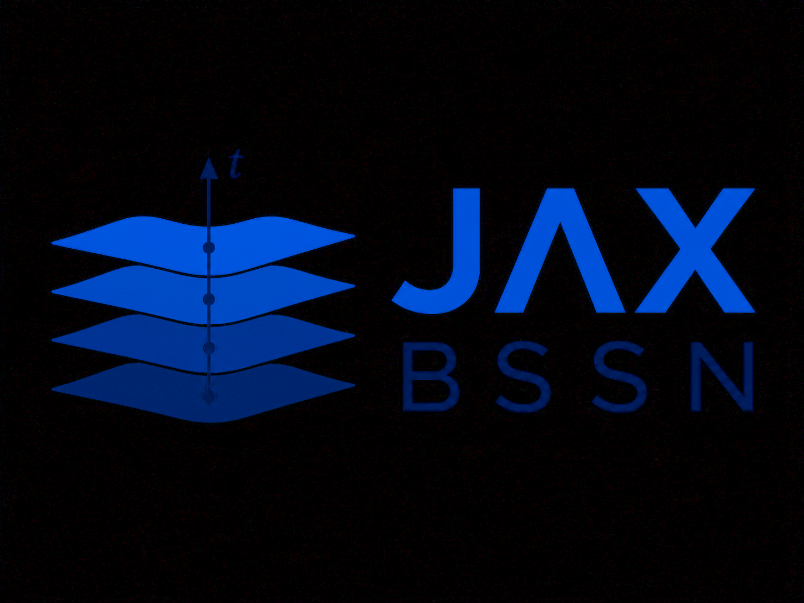

# JAX BSSN

<p align="center">
  
</p>

JAX-BSSN is an autodifferentiable implementation of the BSSN evolution system
for numerical relativity. JAX-BSSN features Kreiss–Oliger dissipation, momentum
constraint damping, and fixed mesh refinement.

## Installation

From the repository root:

```bash
python -m venv .venv
source .venv/bin/activate
python -m pip install --upgrade pip
python -m pip install -e ".[demos,test]"
```

Install a JAX build appropriate for the intended CPU or accelerator when the
default dependency does not match the target hardware.

## Supported demos

The supported physical examples are:

1. Gauge wave
2. Linear wave
3. Single puncture
4. Spherical Cartoon puncture
5. Axisymmetric Cartoon puncture
6. Axisymmetric boosted Bowen--York puncture
7. First-order Einstein--Maxwell black-hole formation candidate
8. Second-order Einstein--Maxwell black-hole formation candidate

Each demo owns its initial data and run configuration. There is no generic
simulation CLI or installed initial-data dispatcher.

Run the periodic analytic gauge wave:

```bash
python demos/gauge_wave/gauge_wave.py
```

Run the linear wave through a nested fixed-refinement hierarchy and write composite
openPMD output:

```bash
python demos/linear_wave/linear_wave.py
```

Run the single Schwarzschild puncture from its demo directory so snapshots and
the optional movie helper share one output path:

```bash
cd demos/single_puncture
python single_puncture.py
python make_movies.py  # optional; requires ffmpeg
```

Run the compact spherical Cartoon puncture and write its complete reflected
axis to openPMD:

```bash
python demos/cartoon_puncture/cartoon_puncture.py
```

Run the z-axis axisymmetric Cartoon puncture and write a signed x-z plane:

```bash
python demos/axisymmetric_cartoon_puncture/axisymmetric_cartoon_puncture.py
```

Run a black hole with Bowen--York momentum along the positive z axis, then
render grouped BSSN movies with a tracked puncture position:

```bash
cd demos/axisymmetric_bowen_york
python axisymmetric_bowen_york.py
python make_movies.py  # optional; requires ffmpeg
```

Run the same constraint-solved electromagnetic dipole data with either the
first-order staggered Yee solver or the second-order cell-centered wave solver:

```bash
python demos/EM_blackhole_formation_first_order/EM_blackhole_formation_first_order.py
python demos/EM_blackhole_formation_second_order/EM_blackhole_formation_second_order.py
```

Each demo owns an identical local copy of the physical initial-data routines
and writes to an `output/` directory beside its script by default. The
first-order openPMD output contains physical `D` and `B`; the second-order
output contains `E` and `B`. The default amplitude remains a
literature-informed candidate.

The initial-data phase solves the rho-weighted Hamiltonian constraint directly
on the positive-rho, full-z Cartoon plane. It uses a conservative radial flux,
regular zero flux at the axis, and fixed `u=0` outer-rho and outer-z rows. Both
demos evolve the Gamma-driver shift, write rolling restart checkpoints, and
record constraint diagnostics and field snapshots. The first-order default
end time is 500 simulation units; the second-order default remains 40. Override
either with `--final-time`. Evolution stops at the last whole timestep at or
before that time, or reports `failed_nonfinite` if the state becomes nonfinite.
A `complete` run has reached its requested step count; this does not certify
black-hole formation or physical settling.

Existing run files are never overwritten by a fresh run; choose a fresh
`--output-dir` or continue `--restart path/to/rolling_checkpoint.npz`. Older
checkpoints remain readable, including runs previously marked `settled`.

Run a separate Schwarzschild comparison with an explicitly chosen positive
mass (1.0 is an example, not a measured remnant mass). It uses the first-order
checkpoint's grid, gauge, and elapsed time, and writes 16 BSSN comparison plots:

```bash
python demos/EM_blackhole_formation_first_order/compare_schwarzschild.py \
  --input-dir path/to/collapse --mass 1.0 \
  --output-dir path/to/new_comparison
```

Regenerate those plots with `--plot-only --input-dir path/to/collapse
--output-dir path/to/new_comparison`; the saved reference supplies the mass.
For a separately evolved openPMD reference, compare lapse and conformal factor:

```bash
python demos/plot_em_blackhole_schwarzschild.py \
  --formation path/to/collapse \
  --reference path/to/reference --mass 1.0 \
  --output path/to/comparison.png
```

Each formation folder contains its own `collapse_io.py` for checkpoints and
summaries, alongside its local initial-data helpers. The first-order folder
also contains `schwarzschild_reference.py`; its `run_schwarzschild_reference`
helper accepts an explicit mass, grid parameters, and final time, and retains
restart support. These workflows live entirely in the demos and are not part
of the installed production package.
Profile error norms use a fixed interval from two formation-grid spacings to
65% of the common radial extent. They do not identify a black-hole exterior.
Coordinate profiles depend on gauge history even with matching gauge settings.

The default production runs compile substantial JAX kernels. The
[demo guide](docs/demos.rst) describes the evolution and comparison options.

## Package structure

```text
JAX_BSSN/
├── bssn/          # state, tensor algebra, geometry, equations, raw constraints
├── cartoon/       # spherical and axisymmetric reconstruction/evolution
├── evolution/     # derivatives, boundaries, RHS assembly, projections, RK4
├── fmr/           # nested-patch geometry, transfers, stage-synchronous RK4
├── diagnostics/   # reductions, reporting, plotting, openPMD
└── utilities/     # reusable initial-data and numerical helper routines
```

Physical initial data lives under `demos/`, not in the installed source
package. Gauge- and linear-wave tests use `tests/initial_data.py` and do not
import executable demos.

## Tests

Install test dependencies and run the complete suite with:

```bash
python -m pip install -e ".[test]"
python -m pytest
```
